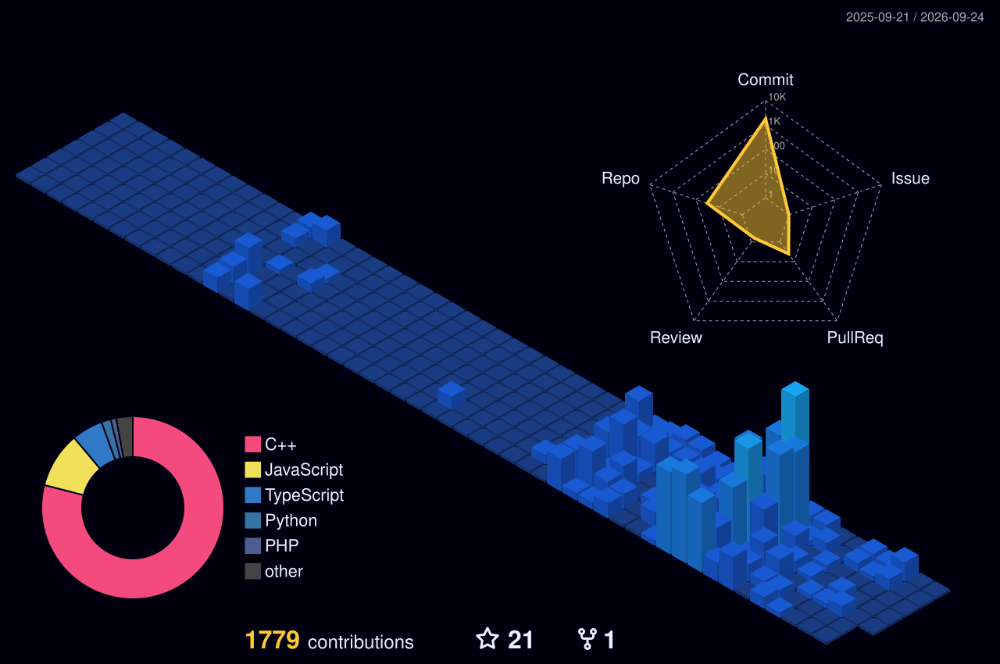

## Hi there 👋
 I'm **Barsha Mondal** 👋  
A passionate Web developer from **NIT Jamshedpur** exploring modern web technologies and software development.

- 💻 Building responsive and modern web applications
- ⚡ Interested in Full Stack Development and UI/UX Design
- 📚 Always curious to learn new technologies and improve problem-solving skills

  

 

## 🛠️ Tech Stack

### 💻 Languages

### 🧱 Libraries & Frameworks

### 🗄️ Databases & ORMs

### ☁️ Cloud & DevOps

### 🧰 Tools & IDEs

### 🌐 Markup & Core Stack

### 🖥️ OS & Shell

 

## 📊 GitHub Dashboard

## 🔥 Contribution Graph

---

## 🚀 DevDock Activity & Projects
I am an **Active Contributor** on DevDock, where I build real-world web applications.

### Featured Tasks (Live)
* 🕒 **[Digital Clock](https://barsha20061001.github.io/My_Portfolio/digital-clock.html)** - A real-time clock built during a DevDock challenge.
* 🎨 **[Color Changer](https://barsha20061001.github.io/My_Portfolio/color-changer.html)** - An interactive UI tool for dynamic background updates.

### Stats
* **Status:** Active Contributor ✅
* **Linked Email:** barshadgp212@gmail.com

## 🌐 Connect With Me

Open to new opportunities, interesting projects, and collaborations. Feel free to reach out!

---

⭐ From [barsha20061001](https://github.com/barsha20061001)
<!--
**barsha20061001/barsha20061001** is a ✨ _special_ ✨ repository because its `README.md` (this file) appears on your GitHub profile.

Here are some ideas to get you started:

- 🔭 I’m currently working on ...
- 🌱 I’m currently learning ...
- 👯 I’m looking to collaborate on ...
- 🤔 I’m looking for help with ...
- 💬 Ask me about ...
- 📫 How to reach me: ...
- 😄 Pronouns: ...
- ⚡ Fun fact: ...
-->
