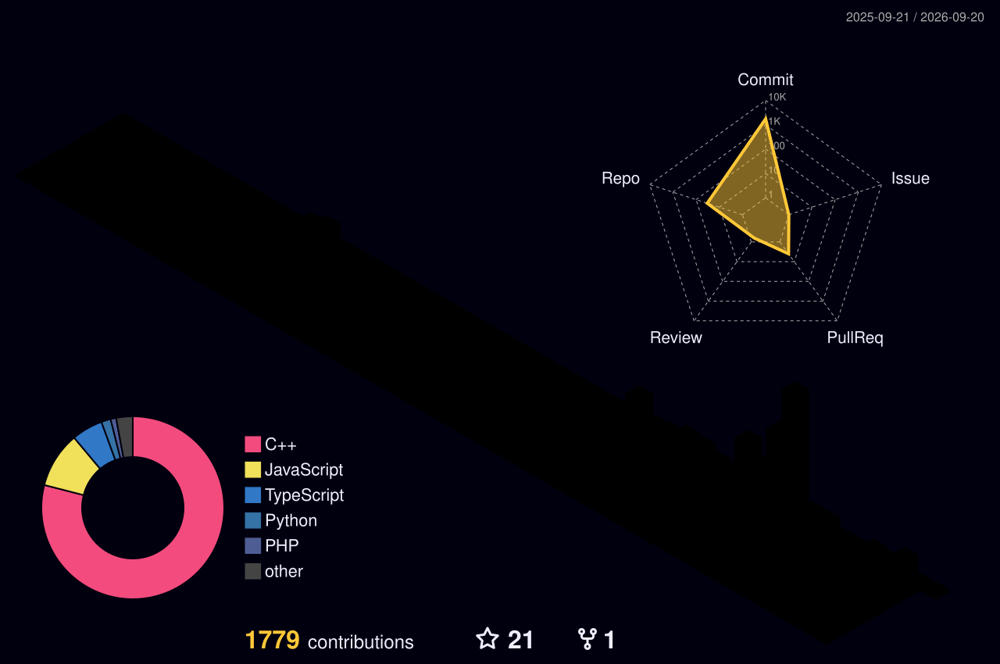

## Hi , I'm **Barsha Mondal** 👋  

A passionate Web developer from **NIT Jamshedpur** exploring modern web technologies and software development.

- 💻 Building responsive and modern web applications
- ⚡ Interested in Full Stack Development and UI/UX Design
- 📚 Always curious to learn new technologies and improve problem-solving skills

 

  

---

  

---

## 🛠️ Tech Stack I have used and worked with

### 💻 Languages

### 🧱 Libraries & Frameworks

### 🗄️ Databases & ORMs

### ☁️ Cloud & DevOps

### 🧰 Tools & IDEs

### 🌐 Markup & Core Stack

 

---

## 📊 GitHub Dashboard

---

## 🔥 Contribution Graph

---

## 🐍 Contribution Snake

  <picture>
    <source media="(prefers-color-scheme: dark)" srcset="https://raw.githubusercontent.com/barsha20061001/barsha20061001/output/github-contribution-grid-snake-dark.svg">
    <source media="(prefers-color-scheme: light)" srcset="https://raw.githubusercontent.com/barsha20061001/barsha20061001/output/github-contribution-grid-snake.svg">
    
  </picture>

---

## 🌐 Connect With Me

Open to new opportunities, interesting projects, and collaborations. Feel free to reach out!

   
  
  

---

⭐ From [barsha20061001](https://github.com/barsha20061001)
---

  

<!--
**barsha20061001/barsha20061001** is a ✨ _special_ ✨ repository because its `README.md` (this file) appears on your GitHub profile.

Here are some ideas to get you started:

- 🔭 I’m currently working on ...
- 🌱 I’m currently learning ...
- 👯 I’m looking to collaborate on ...
- 🤔 I’m looking for help with ...
- 💬 Ask me about ...
- 📫 How to reach me: ...
- 😄 Pronouns: ...
- ⚡ Fun fact: ...
-->
